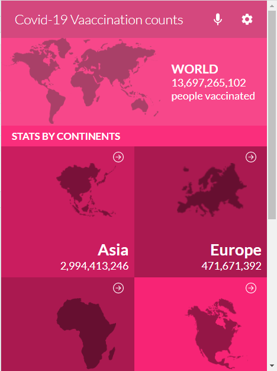
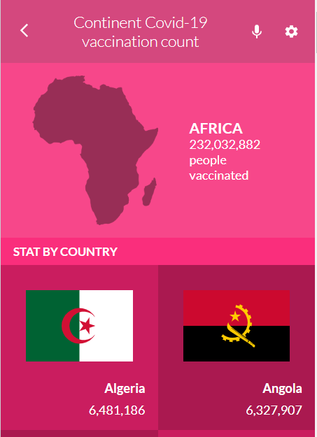

# Covid-19 Vaccination Statistics web app

> This app is a react app that consumes a covid-19 stat API and manipulates the data to display the vaccination metrics country based on continent and country category

## Built With

- Html
- Css
- JavaScript
- Technologies used:
  > React,
  > Jest,
  > Redux,
  > JSON,
  > Gitflow
  > rest API

## live
[View live demo here]()

>  This is the page view:

> |     | Home page                      | single continent page                    |     |
> | --- | ----------------------------------- | ------------------------------------ | --- |
> |     |  |  |

## video Presentation
[View video presentation here](https://www.loom.com/share/91e9e66011154d1baf2b3b10e2f48cdd)

## Getting Started

### Prerequisites

You need to have a browser and this tools installed:

- Git
- NodeJS

### Setup

To get a local copy up and running follow these simple example steps:

```
$ git clone git@github.com:jssol/Covid-19-stat-webapp.git
```

```
$ cd api-based-webapp
```

```
$ npm i
```

```
$ npm start
```

### Usage

To build a version of the website under Development mode:

```
$ npm run dev
```

To build the production version:

```
$ npm run build
```

### Run tests

To run tests in terminal use:

```
npm test
```

### Deployment

To deploy the project to Githubpages run:

```
npm run deploy
```

## Authors

👤 <a href="https://github.com/tylher" target="blank"></a> **Taiwo Damola Adediran**

- GitHub: [@tylher](https://github.com/tylher)
- Twitter: [@tylher123](https://twitter.com/tylher123)
- LinkedIn: [Taiwo Adediran](https://www.linkedin.com/in/taiwo-adediran-327654127/)

## 🤝 Contributing

Contributions, issues, and feature requests are welcome!

Feel free to check the [issues page](../../issues/).

## Show your support

Give a ⭐️ if you like this project!

## Acknowledgments
- Design and inspiration by [Nelson Sakwa on Behance](https://www.behance.net/gallery/31579789/Ballhead-App-(Free-PSDs).
- Hat tip to anyone whose code was used
- Inspiration
- etc

## 📝 License

This project is [MIT](./MIT.md) licensed.
